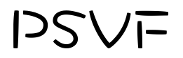
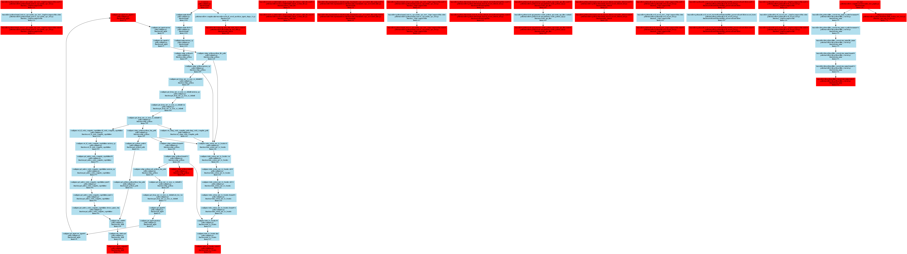

 

Python Static Value-Flow Analysis Framework

Advantage:
- based on value-flow graph
- supports inter-procedural/inter-file analysis
- super fast (20w+ lines / 1 minute)

## Overview

PSVF is a tool designed to find data-flow security issues in python code. The main principle is to build a value flow graph based on python bytecode, and then analyze the graph.

Example errors graph: source/sink points are marked in red.



## Usage

`python3 psvf.py -h`

```buildoutcfg
usage: psvf.py [-h] [-s SCAN_PATH] [-o OUTPUT] [-f FORMAT] [-g] [-v VERSION]

Python Static Value-Flow Analysis Framework

optional arguments:
  -h, --help            show this help message and exit
  -s SCAN_PATH, --scan_path SCAN_PATH
                        specify the scan directory.
  -o OUTPUT, --output OUTPUT
                        specify the output directory.
  -f FORMAT, --format FORMAT
                        specify report format.
  -g, --graph           generate graph file.
  -v VERSION, --version VERSION
                        show version.

```
Run the example: 

`python3 psvf.py -s example/test1 -f json`

View result:

`output/test1_errors.gv.png`
